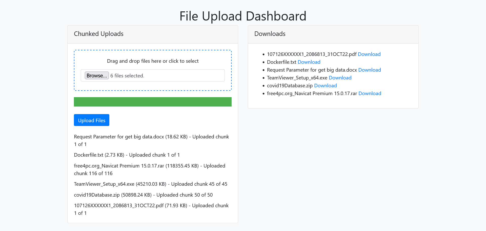

# Efficient File Transfer System Using HTTP for Large Datasets
A PHP-based solution for efficiently transferring large files over the HTTP protocol. This project implements various techniques to optimize file uploads and downloads, ensuring reliability and performance while handling large datasets.


**Topics:** `php`, `mysql`, `blog`, `ajax`, `bootstrap`, `jquery`, `css`, `currency conversion`, `external api integration`, `api integration`



### Install Process

1. **Clone the repository:**
   ```sh
   git clone https://github.com/yourusername/large-file-transfer-http.git
   ```

2. **Navigate to the project directory:**
   ```sh
   cd large-file-transfer-http
   ```

3. **Directory Permission:**
    - If you encounter permission issues, you might need to set more permissive permissions, such as chmod 777, which grants read, write, and execute permissions to everyone:
       ```sh
       chmod 777 assets/uploads
       ```
    - Open `config.php` and update the database configuration details.

4. **Start the development server:**
   ```sh
   php -S localhost:8000
   ```

5. **Access the application:**
    - Open your web browser and navigate to `http://localhost:8000`.


### File Structure

Here’s a basic file structure for your large-file-transfer-http application:

```
large-file-transfer-http/
│
├── index.html
├── assets/
│   ├── css/
│   │   └── chunked-file-upload.css
│   └── js/
│   │   └── chunked-file-upload.js
├── src/
│   ├── chunked-file-upload.php
│   ├── download.php
│   └── get_files.php
├── README.md
└── .gitignore
```
